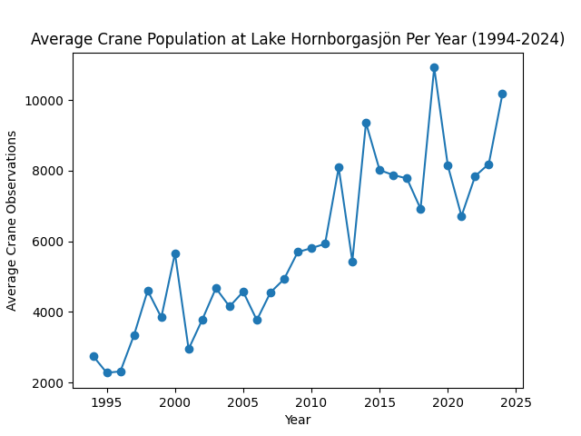

# PyLadies: Crane Dataset Demo 🦢
*Date: 2025-09-29*  
*Presenter: Jennifer Slotnick*

This repo contains the Jupyter Notebook for my PyLadies lightning talk.  
It uses the [TidyTuesday dataset](https://github.com/rfordatascience/tidytuesday) for crane observations at Lake Hornborgasjön.

📓 [View the notebook](PyLadies_PydyTuesday.ipynb)



## How to Run
1. Clone the repo or download the `.ipynb` file.  
2. Install dependencies:  
   ```bash
   pip install pandas matplotlib scikit-learn
3. Open the notebook in Jupyter or VS Code and run cells
